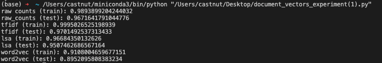

# Report for Document Vectors

*Jiechen Li & Yulei Xia*

## Introduction

In this report, we explore different methods of text representation and classification using a dataset comprised of sentences from works by Jane Austen and Lewis Carroll. We employ four distinct approaches: raw token counts, TF-IDF, Latent Semantic Analysis (LSA), and Word2Vec embeddings, and utilize Logistic Regression for classification. Our goal is to compare the performance of each method and discuss their respective advantages and disadvantages.

## Methods and Results

  

### Raw Token Counts

* Training Accuracy: 98.94%
* Testing Accuracy: 96.72%

Using raw token counts as features, we achieved high accuracy on both training and testing sets. This method is straightforward and easy to implement. However, it doesn't account for the relative importance of words and may overfit due to the high dimensionality of the feature space.

### TF-IDF (Term Frequency-Inverse Document Frequency)

* Training Accuracy: 99.95%
* Testing Accuracy: 97.15%

TF-IDF outperforms raw token counts by considering the importance of terms within and across documents. By penalizing common words and emphasizing unique terms, it improves classification performance. However, it still treats words independently and doesn't capture semantic relationships.

### Latent Semantic Analysis (LSA)

* Training Accuracy: 96.68%
* Testing Accuracy: 95.07%

LSA introduces dimensionality reduction through Singular Value Decomposition, capturing latent patterns in word usage. This leads to a more compact and generalized representation, which explains its competitive performance. However, it involves a lossy transformation and may miss some nuances in the data.

### Word2Vec

* Training Accuracy: 91.08%
* Testing Accuracy: 89.52%

Word2Vec embeddings capture semantic relationships between words and provide a dense representation. Despite slightly lower accuracy, Word2Vec offers a more nuanced understanding of language. Its performance might be affected by the instability you've mentioned due to the lack of fixed random seed and logistic regression function settings.

## Word2Vec Instability Discussion

An interesting observation in our experiments is the instability of the Word2Vec results, particularly in the testing phase. This variability can be attributed to a couple of factors in our experimental setup.

First, the absence of a fixed random seed can lead to non-deterministic behavior during the initialization and training of the Word2Vec model. Random seeds serve as anchors for generating pseudo-random numbers, ensuring that each run of the experiment is consistent with the others. Without fixing the seed, each run can lead to different word embeddings, affecting the downstream classification performance.

Second, the Logistic Regression classifier, when not provided with a fixed random state, can also introduce variability. The solver in the logistic regression may start with different initial coefficients for each run, leading to slightly different optimization paths and, consequently, different model parameters upon convergence.

The combination of these two factors results in fluctuations in the Word2Vec test results. To mitigate this, one could fix the random seeds for both the Word2Vec model and the Logistic Regression classifier. This would ensure a more stable and reproducible performance, allowing us to better evaluate the true efficacy of the Word2Vec embeddings for our classification task.
